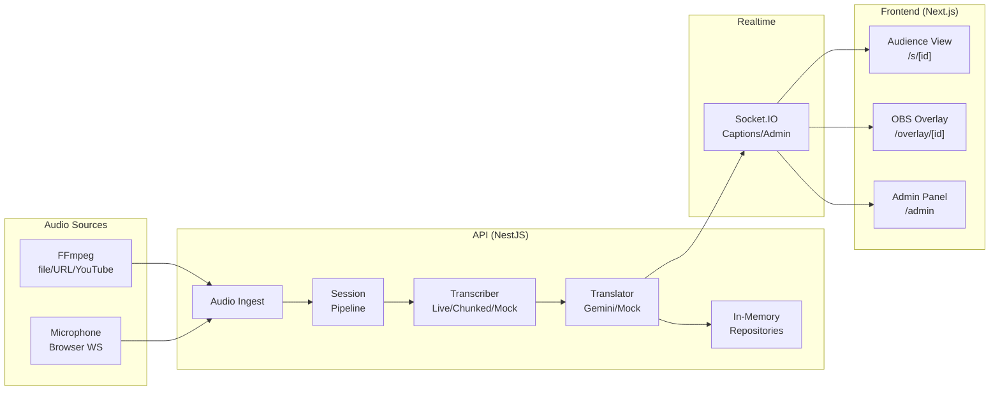

# LiveSubs

**Open source live captions and translation for multi-track conferences.**

---

**Idioma:** [English](#english) · [Español](#español)

---

## English

### What is LiveSubs?

LiveSubs is a real-time captioning and translation system for conferences and large events. It ingests audio from multiple stages simultaneously, transcribes it in the original language, translates it on demand, and streams captions to the audience via a web interface, OBS overlay, and an admin dashboard. Perfect for accessible multilingual events like Nerdearla.

**Built for:** [Nerdearla Vibeathon 2026](https://nerdearla.com) · **Demo:** [Video placeholder — coming soon](#) · **License:** MIT

### Stack

- **Backend:** NestJS 12 (ESM) + Socket.IO + Node.js 22+
- **Frontend:** Next.js 16.3 (App Router) + React 19 + Tailwind CSS 4
- **Shared domain:** TypeScript OOP (no dependencies) with hexagonal ports/adapters
- **AI:** Google Gemini 3.5 Live (streaming transcription) + Gemini 2.5 Flash (text translation + fallback ASR)
- **Ingest:** ffmpeg (file/URL/YouTube via yt-dlp) + Browser microphone (PCM over WebSocket)
- **Tests:** Vitest (full coverage, monorepo-wide)
- **Infrastructure:** Docker + Docker Compose (for local and deployment)

### Architecture



#### Layers

- **Domain** (`packages/domain`): Pure TypeScript, no dependencies. Entities, value objects, domain events, ports (interfaces), contracts (DTOs).
- **Application** (`apps/api/src`): NestJS modules with Dependency Injection. Controllers, services, orchestration.
- **Adapters** (`apps/api/src/{ingest,transcription,translation,persistence,realtime}`): Implementations of ports (Gemini, FFmpeg, in-memory repos, Socket.IO).
- **Presentation** (`apps/web/src`): Next.js pages, React components, client Socket.IO.

### Key Features

- ⚡ **Real-Time Gemini 3.5 Live Speech-to-Text:** Ultra-low latency streaming speech-to-text pipeline.
- 🌐 **Instant AI Translation:** Translates talks on the fly to Spanish (or other target languages) with domain-tuned glossaries (e.g., Nerdearla tech terms).
- 📺 **Split-Screen & Companion Video Comparison:** View the live YouTube talk side-by-side with subtitles or open it in a synchronized companion tab to compare audio and captions in real time.
- 💬 **Smart Subtitle Grouping:** Automatically groups fragmented speech segments into natural sentences and paragraphs with start/end timestamps and original vs. translated views.
- 🔁 **Continuous Audio Looping:** Built-in looping option for continuous multi-track conference demo simulation.
- 🎙️ **Microphone Ingest:** Ingest real speaker audio directly from the browser via AudioWorklet PCM streaming.
- 🎥 **OBS Overlay Ready:** Transparent, responsive overlay URL (`/overlay/[id]?lang=es`) ready to embed as a browser source in streaming software.
- 💾 **Instant Multi-Format Export:** Download full transcripts in SRT, WebVTT, or plain text formats.
- 🦄 **100% Open Source:** Fully open source under the permissive MIT license.

### Quickstart

#### Option A: Docker Compose (Recommended)

Run the entire platform with Docker Compose — no need to install Node.js, pnpm, ffmpeg, or yt-dlp on your host machine.

```bash
# 1. Clone repository
git clone https://github.com/LorenGrz/VibeathonNerdearla2026.git
cd VibeathonNerdearla2026

# 2. Configure environment
cp .env.example .env
# Edit .env and set your GEMINI_API_KEY for real-time AI transcription & translation.
# (Or leave TRANSCRIBER=mock TRANSLATOR=mock for zero-config offline testing)

# 3. Start all services
docker compose up --build
```

- **Audience & Home:** [http://localhost:3000](http://localhost:3000)
- **Admin Control Panel:** [http://localhost:3000/admin](http://localhost:3000/admin)
- **API Health Check:** [http://localhost:4000/api/health](http://localhost:4000/api/health)

To stop the containers:
```bash
docker compose down
```

---

#### Option B: Local Bare-Metal Development

##### Prerequisites

- Node.js 22+ (or via `nvm use`)
- pnpm 12+ (`npm install -g pnpm`)
- ffmpeg + yt-dlp (for audio ingest)
- Docker & Docker Compose (optional)

##### 1. Setup

```bash
# Clone and install
git clone https://github.com/LorenGrz/VibeathonNerdearla2026.git
cd VibeathonNerdearla2026
pnpm install

# Build shared domain
pnpm build:domain
```

##### 2. Mock Mode (no API key required)

```bash
# Terminal 1: API in mock mode (in-memory, no real transcription)
TRANSCRIBER=mock TRANSLATOR=mock pnpm dev

# Terminal 2: Open browser
# http://localhost:3000 — session listing and creation
# http://localhost:3000/admin — production panel (create/start/stop sessions)
```

Then:

1. Navigate to **Admin** (`http://localhost:3000/admin`)
2. Click **Create Session**:
   - Title: `"English Talk"`
   - Stage: `"Main"`
   - Source Language: `en`
   - Target Languages: `[es]`
   - Audio Source: `file: tone-2s.mp3` (included sample)
3. Click **Start**
4. Open **Audience View** (`http://localhost:3000/s/<id>?lang=es`) in a second tab to see mock captions stream
5. Export as SRT/VTT when done

**Expected behavior:** Captions appear as `[MOCK]` in orange; latency is minimal; no Gemini API calls.

##### 3. Gemini Live Mode

Requires a Google Gemini API key:

```bash
# Get your API key at https://ai.google.dev/ or https://aistudio.google.com/
export GEMINI_API_KEY="<your-key>"

# Set transcriber to live
TRANSCRIBER=live TRANSLATOR=gemini pnpm dev
```

Then repeat the quickstart steps, but:

- Choose a real audio file from `samples/` or paste a YouTube URL
- Captions will stream in real-time from Gemini Live API (English input only)
- Translations to Spanish (or other configured languages) happen per-segment with Gemini Flash
- Turn on **"Dividir Pantalla"** or **"Abrir en YouTube ↗"** to compare audio and translation in real time!

**Model details:**

- `GEMINI_LIVE_MODEL=gemini-3.5-transcribe-live` (streaming speech-to-text, verified 2026-09-25)
- `GEMINI_TEXT_MODEL=gemini-3.5-flash-lite` (translations + chunked fallback)

#### Environment Variables Reference

Root `.env` (used by Docker Compose) or `apps/api/.env`:

```
PORT=4000
WEB_ORIGIN=http://localhost:3000,http://127.0.0.1:3000
TRANSCRIBER=live           # live | chunked | mock
TRANSLATOR=gemini          # gemini | mock
GEMINI_API_KEY=            # Required for live/gemini modes
GEMINI_LIVE_MODEL=gemini-3.5-transcribe-live
GEMINI_TEXT_MODEL=gemini-3.5-flash-lite
MAX_SESSIONS=12            # Concurrent sessions per process
SAMPLES_DIR=/app/samples   # Or ../../samples for local development
NEXT_PUBLIC_API_URL=http://localhost:4000
```

### Audio Samples

The `samples/` directory includes:

- **`tone-2s.mp3`**: 440 Hz sine tone, 2 sec, synthetic (included)
- **`en-nerdearla.mp3`**, **`es-nerdearla.mp3`**: Real Nerdearla clips (~90 s each) — fetch with:
  ```bash
  scripts/fetch-samples.sh
  ```
  (Talks: "Model Context Protocol in Plain English" — Nate Barbettini, and "No sos Netflix" — J. Rodríguez Monti; see `samples/README.md`. Clips are git-ignored.)

### OBS Integration

Use LiveSubs overlay as a **Browser Source** in OBS:

1. Go to `/overlay/[session-id]?lang=en&lines=2`
   - `lang`: `en`, `es`, `pt` (display language)
   - `lines`: number of simultaneous captions (default 2)
2. Copy the URL
3. In OBS → Add Source → Browser → Paste URL
4. Set resolution to match your canvas (e.g., 1920×1080)
5. Overlay is transparent; text is white on a dark background

**Example:** `http://localhost:3000/overlay/abc123?lang=es&lines=3`

### Export

Each session can be exported as SRT, VTT, or TXT:

```bash
# Via Admin panel: click session → "Download" → choose format
# Or via API:
curl "http://localhost:4000/api/sessions/<id>/export?lang=es&format=srt" \
  -o session.srt
```

### Commands

Root-level scripts:

```bash
pnpm dev              # Start API and web in watch mode (requires pnpm build:domain first)
pnpm build:domain     # Build shared TypeScript domain (run before dev/test)
pnpm build            # Build all (api, web, domain)
pnpm lint             # Lint all (ESLint, oxlint)
pnpm typecheck        # TypeScript check + domain build
pnpm test             # Run all Vitest suites
pnpm format           # Format with Prettier
pnpm format:check     # Check formatting
```

Per-app:

```bash
# API
pnpm --filter @subs/api dev
pnpm --filter @subs/api test:e2e      # E2E Socket.IO tests
pnpm --filter @subs/api start:prod    # Production (requires build first)

# Web
pnpm --filter @subs/web dev
pnpm --filter @subs/web build
pnpm --filter @subs/web start         # Production
```

### Docker & Docker Compose

LiveSubs is fully containerized and production-ready with Docker Compose.

#### Architecture in Docker

```
  ┌────────────────────────────────────────────────────────┐
  │                   Host Machine                         │
  │                                                        │
  │    Port 3000                           Port 4000       │
  │       │                                    │           │
  │  ┌────▼─────────────┐             ┌────────▼────────┐  │
  │  │   livesubs-web   │             │  livesubs-api   │  │
  │  │  (Next.js 16)    │             │ (NestJS 12 API) │  │
  │  │  React 19        │             │ ffmpeg + yt-dlp │  │
  │  │  Tailwind CSS 4  │             │ Gemini Live WS  │  │
  │  └────────┬─────────┘             └────────▲────────┘  │
  │           │      Internal Network          │           │
  │           └────────────────────────────────┘           │
  │                                                        │
  └────────────────────────────────────────────────────────┘
```

- **`livesubs-api`**:
  - Base: `node:22-alpine`
  - System Dependencies: `ffmpeg` 8.1+ and `yt-dlp` installed natively via Alpine package manager for high-efficiency audio demuxing and streaming.
  - Builds the shared `@subs/domain` package and `@subs/api`.
  - Exposes port `4000`.
  - Health check: HTTP probe on `/api/health` validates readiness before web traffic routes to it.
  - Volume: Mounts `./samples` read-only at `/app/samples`.

- **`livesubs-web`**:
  - Base: `node:22-alpine`
  - Builds and serves the Next.js 16 standalone application.
  - Exposes port `3000`.
  - Health check: HTTP probe on root path `/`.
  - Depends on `livesubs-api` condition `service_healthy`.

#### Common Commands

```bash
# Build images and start all containers in background
docker compose up --build -d

# Check status and health of containers
docker compose ps

# View live logs
docker compose logs -f

# Follow API logs specifically
docker compose logs -f api

# Stop and remove containers
docker compose down
```

### Architecture Decisions

1. **Shared OOP domain** (`packages/domain`): All business logic lives in pure TypeScript classes. No framework dependencies. Consumed by NestJS (server) and Next.js (client via types and exporters). Allows parallel testing and easy refactoring.

2. **Hexagonal ports/adapters**: Transcriber, translator, repositories, event publisher are _interfaces_. Multiple implementations (Live, Chunked, Mock for transcriber; Gemini, Mock for translator; in-memory for now). Easy to swap and test.

3. **In-memory persistence**: MVP scope. Segments are lost on restart but sufficient for single-event use. Redis adapter for Socket.IO is optional for horizontal scaling.

4. **Mock transcriber first**: Enables full integration testing and demos without an API key. `TRANSCRIBER=mock` produces predictable captions for all audio, making the flow reproducible.

5. **Session-per-pipeline**: One `SessionPipeline` per session (concurrent limit = `MAX_SESSIONS`). Audio → transcriber → translator → events → websocket rooms per language. Stateless web frontend; events are the source of truth.

6. **Gemini Live for ASR**: Lowest latency for streaming. Chunked fallback (`generateContent` every ~4 s) for longer audio or as a degradation mode.

7. **Glossary in prompts**: Domain-specific terms (e.g., "Kubernetes", "Nerdearla") are injected into translation prompts to ensure correct terminology.

### Lessons Learned

- **Streaming is hard.** Gemini Live has session limits (~10 min) and requires graceful reconnection logic. Chunked fallback adds complexity but is essential.
- **WebSocket room isolation:** Socket.IO rooms by `session:id:lang` prevent cross-talk and simplify client-side filtering.
- **TypeScript + NestJS ESM:** Relative imports must include `.js` extensions; `nodenext` module resolution is stricter than CommonJS.
- **Next.js App Router:** File-based routing and server/client boundaries are powerful but require discipline. Test the `node_modules/next/dist/docs/` for version-specific APIs.
- **Mock mode saves development time.** Most features can be built and validated without an API key or real audio.
- **Glossary and cultural context matter.** Live translation without domain knowledge produces wrong output; always include a glossary for technical or regional terms.

### Next Steps

1. **Horizontal scaling:** Add `@socket.io/redis-adapter` for multi-instance API + session assignment.
2. **Microphone input (T11):** `/admin/mic/[id]` for browser capture (AudioWorklet → PCM → API).
3. **ES→EN translation:** Extend `targetLanguages` to include reverse direction.
4. **Portuguese:** Add `pt` support (Gemini already handles it).
5. **Live demo on Nerdearla:** Deploy to production, integrate with CI, test with real talks.
6. **Metrics & monitoring:** Prometheus + Grafana for latency, error rates, session counts.
7. **Admin glossary editor:** Allow updating glossary at runtime (currently static).

---

## Español

### ¿Qué es LiveSubs?

LiveSubs es un sistema de subtítulos y traducción en tiempo real para conferencias y eventos. Ingesta audio de múltiples escenarios, transcribe en idioma original, traduce bajo demanda y transmite subtítulos a la audiencia via interfaz web, overlay OBS y panel de administración. Perfecto para eventos multilingües accesibles como Nerdearla.

**Construido para:** [Nerdearla Vibeathon 2026](https://nerdearla.com) · **Demo:** [Placeholder de video — próximamente](#) · **Licencia:** MIT

### Stack

- **Backend:** NestJS 12 (ESM) + Socket.IO + Node.js 22+
- **Frontend:** Next.js 16.3 (App Router) + React 19 + Tailwind CSS 4
- **Dominio compartido:** TypeScript OOP (sin deps) con puertos/adaptadores hexagonales
- **IA:** Google Gemini 3.5 Live (transcripción en streaming) + Gemini 2.5 Flash (traducción + ASR fallback)
- **Ingest:** ffmpeg (archivo/URL/YouTube via yt-dlp) + micrófono del navegador (PCM via WebSocket)
- **Tests:** Vitest (cobertura completa, monorepo)
- **Infraestructura:** Docker + Docker Compose

### Arquitectura

[Diagrama del pipeline: igual al anterior en English]

#### Capas

- **Dominio** (`packages/domain`): TypeScript puro, sin dependencias. Entidades, VOs, eventos, puertos, contratos.
- **Aplicación** (`apps/api/src`): Módulos NestJS con inyección. Controllers, servicios, orquestación.
- **Adaptadores** (`apps/api/src/{ingest,transcription,translation,persistence,realtime}`): Implementaciones de puertos.
- **Presentación** (`apps/web/src`): Next.js, React, Socket.IO cliente.

### Características Principales

- ⚡ **Transcripción en tiempo real con Gemini 3.5 Live:** Pipeline streaming con latencia ultra baja.
- 🌐 **Traducción IA instantánea:** Traduce charlas al vuelo al español u otros idiomas objetivo, con glosarios adaptados al dominio técnico (términos de Nerdearla, software y Cloud Native).
- 📺 **Comparación de Video en Pantalla Dividida o Pestaña Compañera:** Visualizá la charla de YouTube en split-screen junto a los subtítulos o abrila en otra pestaña para auditar sincronía y precisión en vivo.
- 💬 **Agrupación Inteligente de Subtítulos:** Concatena fragmentos de voz rápidos en párrafos legibles con marcas de tiempo precisas y visualización bilingüe.
- 🔁 **Modo Bucle Continuo:** Posibilidad de reproducir muestras en bucle ininterrumpido para stands o demos continuas en conferencias.
- 🎙️ **Ingesta por Micrófono:** Captura audio de oradores en vivo desde el navegador vía streaming PCM con AudioWorklet.
- 🎥 **Overlay para OBS:** URL transparente (`/overlay/[id]?lang=es`) lista para incrustar como Browser Source en OBS Studio o vMix.
- 💾 **Exportación Multi-formato:** Descargá transcripciones completas en SRT, WebVTT o texto plano.
- 🦄 **100% Open Source:** Código abierto bajo la licencia permisiva MIT.

### Quickstart

#### Opción A: Docker Compose (Recomendada)

Levantá todo el stack con un único comando, sin necesidad de instalar Node.js, pnpm, ffmpeg ni yt-dlp en tu sistema host.

```bash
# 1. Clonar el repositorio
git clone https://github.com/LorenGrz/VibeathonNerdearla2026.git
cd VibeathonNerdearla2026

# 2. Configurar variables de entorno
cp .env.example .env
# Editá .env y colocá tu GEMINI_API_KEY para transcripción y traducción en vivo con IA.
# (O dejá TRANSCRIBER=mock TRANSLATOR=mock para probar de inmediato en modo offline)

# 3. Iniciar todos los servicios
docker compose up --build
```

- **Audiencia y Home:** [http://localhost:3000](http://localhost:3000)
- **Panel de Control Admin:** [http://localhost:3000/admin](http://localhost:3000/admin)
- **API y Health Check:** [http://localhost:4000/api/health](http://localhost:4000/api/health)

Para detener los contenedores:
```bash
docker compose down
```

---

#### Opción B: Desarrollo Local

##### Requisitos

- Node 22+ (o vía `nvm use`)
- pnpm 12+
- ffmpeg + yt-dlp (para ingesta de audio)
- Docker + Docker Compose (opcional)

##### 1. Setup

```bash
git clone https://github.com/LorenGrz/VibeathonNerdearla2026.git
cd VibeathonNerdearla2026
pnpm install
pnpm build:domain
```

##### 2. Modo Mock (sin API key)

```bash
TRANSCRIBER=mock TRANSLATOR=mock pnpm dev
# http://localhost:3000/admin → crear sesión, iniciar
# http://localhost:3000/s/<id>?lang=es → audiencia
```

##### 3. Modo Gemini Live

```bash
# Obtené tu clave en https://ai.google.dev/ o https://aistudio.google.com/
export GEMINI_API_KEY="<tu-clave>"
TRANSCRIBER=live TRANSLATOR=gemini pnpm dev
```

Activá **"Dividir Pantalla"** o **"Abrir en YouTube ↗"** en la vista de audiencia para ver el video y los subtítulos sincronizados en tiempo real.

### Variables de entorno

Archivo `.env` en la raíz (usado por Docker Compose) o en `apps/api/.env`:

```
PORT=4000
WEB_ORIGIN=http://localhost:3000,http://127.0.0.1:3000
TRANSCRIBER=live           # live | chunked | mock
TRANSLATOR=gemini          # gemini | mock
GEMINI_API_KEY=            # Requerido para modos live/gemini
GEMINI_LIVE_MODEL=gemini-3.5-transcribe-live
GEMINI_TEXT_MODEL=gemini-3.5-flash-lite
MAX_SESSIONS=12
SAMPLES_DIR=/app/samples   # O ../../samples para desarrollo local
NEXT_PUBLIC_API_URL=http://localhost:4000
```

### Muestras de audio

- `tone-2s.mp3` (incluido)
- `en-nerdearla.mp3`, `es-nerdearla.mp3` (fetch con `scripts/fetch-samples.sh`)

### OBS Overlay

Usa `/overlay/[id]?lang=es&lines=2` como Browser Source en OBS.

### Export

Panel de Admin: click sesión → Download → formato (SRT/VTT/TXT).

O vía API: `GET /api/sessions/<id>/export?lang=es&format=srt`

### Comandos

```bash
pnpm dev              # API + web en watch mode
pnpm build:domain     # Compilar dominio
pnpm lint             # Lint
pnpm typecheck        # TypeScript
pnpm test             # Tests
pnpm format           # Prettier
```

### Docker & Docker Compose

LiveSubs está 100% contenerizado y listo para producción mediante Docker Compose.

- **`livesubs-api`**:
  - Base `node:22-alpine` con `ffmpeg` y `yt-dlp` instalados nativamente vía paquetes Alpine.
  - Expone el puerto `4000`.
  - Health check en `/api/health` para asegurar que el servicio esté operativo.
  - Volumen `./samples` montado de solo lectura en `/app/samples`.

- **`livesubs-web`**:
  - Base `node:22-alpine` con build optimizado en modo standalone de Next.js 16.
  - Expone el puerto `3000`.
  - Health check en la raíz `/`.
  - Depende del estado `healthy` de `livesubs-api`.

```bash
# Iniciar en segundo plano
docker compose up --build -d

# Ver estado de los contenedores
docker compose ps

# Seguir logs
docker compose logs -f

# Detener los contenedores
docker compose down
```

### Decisiones de arquitectura

1. **Dominio OOP compartido:** Toda la lógica en `packages/domain`, consumida por NestJS y Next.js.
2. **Puertos/adaptadores:** Múltiples implementaciones (Live/Chunked/Mock, Gemini/Mock, in-memory).
3. **Persistencia in-memory:** MVP; suficiente para eventos de un día. Redis adapter opcional.
4. **Mock first:** Desarrollo y testing sin API key.
5. **Pipeline por sesión:** Límite de concurrencia = `MAX_SESSIONS`.
6. **Gemini Live:** Latencia mínima; reconnexión automática.
7. **Glosario en prompts:** Términos técnicos inyectados en traducciones.

### Lecciones aprendidas

- El streaming es difícil; Gemini Live tiene límites de sesión.
- Aislamiento de salas Socket.IO por idioma.
- NestJS ESM requiere `.js` en imports.
- Next.js App Router es poderoso pero necesita disciplina.
- El modo Mock ahorra mucho tiempo de desarrollo.
- Glosario + contexto cultural = traducciones correctas.

### Próximos pasos

1. Escalado horizontal con Redis adapter.
2. Captura de micrófono del navegador.
3. Traducción ES→EN.
4. Soporte para portugués.
5. Deploy en Nerdearla en vivo.
6. Métricas y monitoring.
7. Editor de glosario en admin.

---

## Micrófono

Subtitular hablando al micrófono del navegador (fuente `mic`):

1. En `/admin` creá una sesión con fuente **Micrófono** y tocá **Iniciar**.
2. En la fila de la sesión abrí **Micrófono** (`/admin/mic/<id>`), tocá **Iniciar micrófono** y aceptá el permiso (requiere `localhost` o HTTPS).
3. El navegador captura con un AudioWorklet (`public/worklets/pcm-capture.js`), convierte a PCM Int16 16 kHz mono en tramas de 100 ms (`src/features/mic/pcm.ts`) y las envía por Socket.IO a `/mic` (`mic:start`, `mic:chunk`, `mic:stop`).
4. La API (`MicGateway` → `MicAudioSource`, detrás de `CompositeAudioSource`) acepta un solo emisor por sesión y descarta el audio más viejo si la cola supera 2 s.

Con `TRANSCRIBER=live` y `GEMINI_API_KEY` los subtítulos salen en `/s/<id>`. Detener el micrófono no detiene la sesión: se detiene desde el panel.

---

## License

MIT — see [LICENSE](LICENSE)
